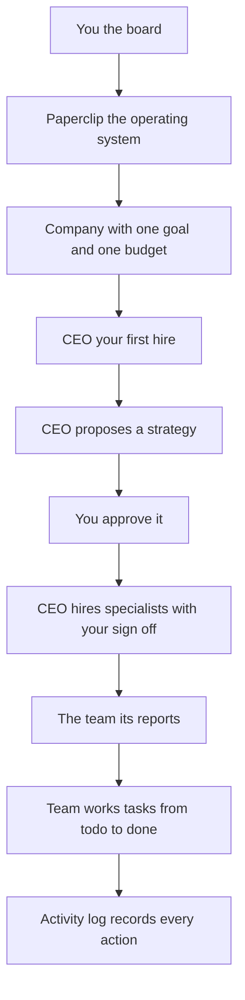

# Building a Workforce with Paperclip

*Source: The AI Agent Factory — "Building a Workforce with Paperclip: A 90-Minute Crash Course" (Panaversity)*
*URL: https://agentfactory.panaversity.org/docs/workforce-with-paperclip-crash-course*
*Group: Mode 2 — Manufacturing, Phase 3 · Scale the Workforce (Chapter 3 of 9)*

---

## Yeh Course Kis Baare Mein Hai

**7 Scenarios. Kuch nahi se ek AI company tak jo real cheezein banaye, aap board ki tarah chalate ho.**

**Paperclip** AI agents ki company chalane ke liye ek operating system hai. Aap goal set karte ho aur
agents hire karte ho kaam karne ke liye. Woh plan aur execute karte hain; aap woh decisions approve
karte ho jo matter karte hain. Startup ki tarah kaam karta hai: aap ek CEO agent hire karte ho, woh
strategy propose karta hai, approve hone par CEO kaam ko tasks mein todta hai aur team ko assign karta
hai.

**~90 minute mein, laptop par ek chalti hui AI company:**
- Ek **CEO** jo aap ne hire kiya, aapko board ki tarah report karta hua
- Ek **team** jo CEO ne hire ki, delegated real kaam ke sath
- **Budgets, approvals, audit trail** jo sab kuch aapke control mein rakhein

**CEO leader hai, laborer nahi:** woh plan aur delegate karta hai, jo specialists woh hire karta hai
woh tasks carry karte hain.

## Parts

1. [Setup Aur Company (Scenarios 1-2)](00-setup-and-company.md)
2. [Strategy Aur Team (Scenarios 3-4)](01-strategy-and-team.md)
3. [Budget Aur Audit (Scenarios 5-6)](02-budget-and-audit.md)
4. [Workspace Aur Company Chalana (Scenario 7 + Monthly Audit)](03-workspace-and-operating.md)

---

## Collaboration Pattern

3 players: **Aap** board ho — woh decisions lete ho jo sirf insan le sakta hai. **Aapka general agent**
Paperclip ka CLI chalata hai. **Paperclip** agents ke upar ki layer hai — company hold karta hai aur
employees ko jagata hai.

*Yeh summary poore course (Setup + Strategy/Team + Budget/Audit + Workspace/Operating) ka overview
hai.*
